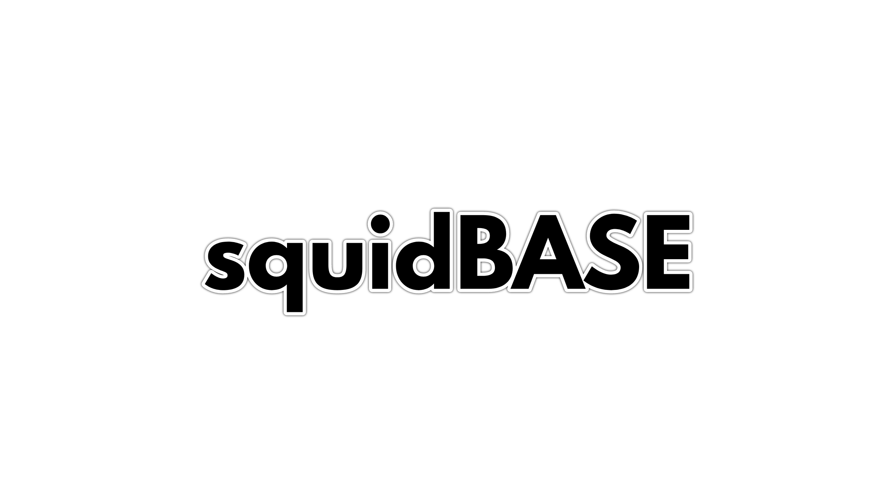

# squidBASE



The squidBASE framework is built to allow web and android app developers to reach a breaching point, the framework allows this by making it similar to how android UI works.

squidBASE is just html in the backend, all squidBASE does is to reduce the amount of code needed to make interfaces using html, the main purpose for squidBASE is to act as a base for developers to create re-usable components that can be implemented easily.

Id like to give special Thanks To Creators of Animate.css

[Animate.css | A cross-browser library of CSS animations.](https://animate.style/)

So as the contributors to beer.css which allow squidBASE to port Material Design 3

[Beer.css | Build Material Design In Real Time.](https://www.beercss.com/)

### How This Works:

All Your Code Is Placed Within the ‘app.mjs’ file and is references within index after the ‘standard_lib.mjs’ file has been loaded.

```jsx
import { ui,loadStyle } from'./App_Core/main.mjs'

var textSearch;
function onStart(){
    const lay = ui.addLayout('Linear','FillXY,HCenter,Vertical',null,null,'main');
    
    const btn = ui.addButton('Begin Your Search For squidBASE Packages 🤖',380,50,'search',null,lay)
    btn.setOnTouch(()=>{
        btn.animate('animate__backOutDown',()=>{
            textSearch = ui.addTextField('text','Find Your squidBASE Packages 👻',380,50,'search',null,lay);
            textSearch.animate('animate__backInDown');
        });
    });
    ui.render();
}

document.addEventListener('DOMContentLoaded',()=>{
    onStart();
})
```
### **Project Contributing**

_Why & How's?_

This project is very large, it will take long to get to 1.0 however this project is getting sturdy with each update.
squidBASE is made to make development easier and way faster, we all want that and I will deliver on that as long as I don't accidentally kick a bucket 😬.
Hopefully someone will pick it up and if that happens,

 _top G don't forget to mention the OG_

Please your code submission must have your code clean, remember your code must always document itself and let's be nice, it doesn't cost to be nice and it don't cost to be the grinch, but it costs the project.


**My Contacts:**

oarabilekoore@protonmail.com [Email]

@oneofakind_tm [Instagram]
